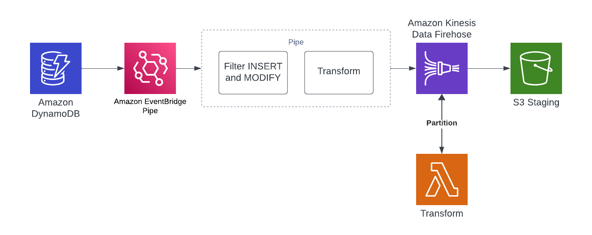

# DynamoDB Partitioned S3 

Purpose: Working example of using DynamoDB Streams, EventBridge Pipes and Kinesis Firehouse
to build a partitioned S3 bucket that can be used for Glue Analytics

## Getting Started

### Deploying

First off, install [Node.js](https://nodejs.org/en)

```bash
# install AWS CDK
npm install -g aws-cdk
# clone the repository
cd dynamodb-partioned-s3
npm install
```

Once dependencies have been installed, you are ready to run CDK

```bash
cdk deploy
```

## Destroying

Simply run:

```bash
cdk destroy
```

## Implementation

For a further and in-depth review of how to use this repository and what it supports, head on over the [Blog Article](https://binaryheap.com) <Article not complete but under construction>

## Architecture


